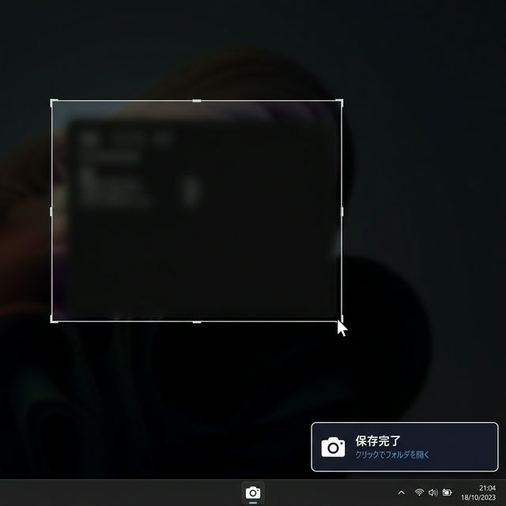

# QuickShot 📸


**QuickShot** is a lightweight, hotkey-driven screenshot utility for Windows — built for developers and AI power users who need to capture, copy, and pin screen regions in an instant.

> Capture → Clipboard → Paste into ChatGPT / Gemini / Claude. Zero friction.



---

## ✨ Features

| Hotkey | Action |
|---|---|
| `Ctrl + Shift + A` | Draw a region and capture (saves as file + clipboard) |
| `Ctrl + Shift + S` | Full-screen capture — supports **multi-monitor selection** |
| `Ctrl + Shift + Z` | **Pin a region** to screen as a floating overlay |
| `Ctrl + Shift + Q` | Quit QuickShot |

- 📁 **Auto-saves** to `Pictures\QuickShots\YYYY-MM-DD\`
- 📋 **Auto-copies** the image to clipboard — just `Ctrl+V` to paste
- 🖼️ **Formats**: PNG, JPEG, WEBP (configurable quality)
- 🔔 **Toast notification** with a clickable folder link after each save
- 📌 **Pin to screen** — keep a captured region floating on top while you type prompts

---

## 🚀 Quick Start

### Requirements

- Windows 10 / 11
- Python 3.8+

### Installation

```bash
# 1. Clone the repository
git clone https://github.com/okamotoryolee/quick_region_screenshot.git
cd quick_region_screenshot

# 2. Install dependencies
pip install -r requirements.txt

# 3. Run QuickShot
python quick_region_screenshot.py
```

The app starts silently in the background and listens for hotkeys.

> 💡 **Tip**: For easy startup, double-click `run_quickshot_debug.bat`  
> (displays errors if something goes wrong — handy for troubleshooting)

---

## ⚙️ Configuration

Open `quick_region_screenshot.py` and edit the settings block at the top:

```python
SAVE_FORMAT   = "WEBP"   # "PNG", "JPEG", "WEBP"
IMAGE_QUALITY = 80       # 1–100 (for JPEG and WEBP)
TOAST_DURATION_MS = 4500 # Toast display time
```

---

## 💡 Why QuickShot?

Most screenshot tools are designed for documentation — they open editors, add markup, or sync to the cloud.

QuickShot is designed for **speed and AI workflows**:

- No editing step. Capture → Clipboard → Paste.
- Pin a reference image on screen while writing a prompt.
- Multi-monitor aware — no accidental wrong-screen captures.

---

## 🌱 Philosophy

> Coding feels like building a waterwheel.  
> Where ancient people turned rivers and winds into steady motion,  
> I turn flows of information and AI's knowledge into working tools.  
> QuickShot is my first waterwheel.

---

## 📄 License

MIT — free to use, modify, and distribute.
